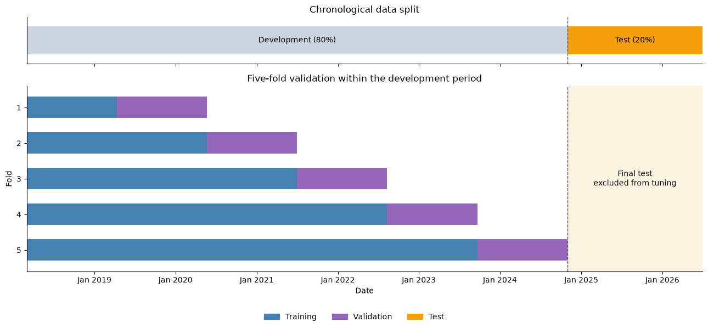
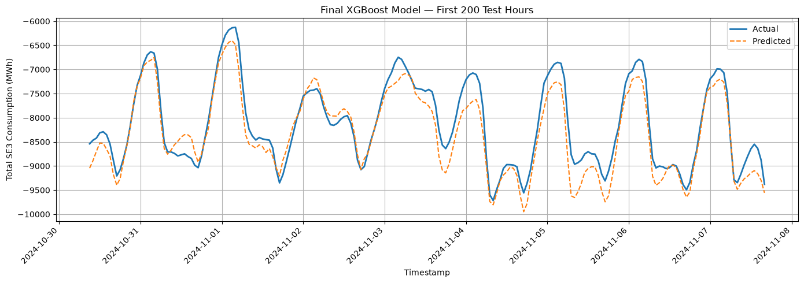

# Swedish SE3 Electricity Demand Forecasting

A trained time-series model for forecasting electricity consumption in Sweden’s SE3 bidding zone.

## 1. Study objective

This project investigates the use of historical electricity demand and external weather variables to forecast total electricity consumption in the Swedish SE3 bidding zone.

The objectives are to:

- Build a reproducible electricity-demand forecasting pipeline.
- Create useful time-series and weather-based features.
- Train an XGBoost regression model.
- Tune the model using Optuna.
- Evaluate the final model on unseen future data.

## 2. Data

The project uses:

- Historical electricity consumption for the Swedish SE3 bidding zone.
- External weather observations corresponding to the study period.
- Time-series features derived from the demand data, including lagged and calendar-based variables.

The data is organized chronologically, with training observations preceding validation and test observations.

**Study period:** The saved training notebook contains 73,032 hourly observations from March 2, 2018 through June 30, 2026. See the date ranges printed in [03_model_training.ipynb](03_model_training.ipynb) for the current run.

**Target variable:** `total_consumption`, measured in MWh.

## 3. General approach

The workflow consists of three stages:

1. **Preprocessing:** Cleaning and preparing the electricity-demand and weather data.
2. **Feature engineering:** Creating time-series, calendar, lagged-demand, and weather features.
3. **Model training and evaluation:** Training and tuning an XGBoost regression model and evaluating it on a final held-out test period.

The data is split chronologically:

- **80% development data:** 58,425 observations in the saved run.
- **20% final test data:** 14,607 observations in the saved run.

Five-fold `TimeSeriesSplit` cross-validation is performed only on the development data. Each fold uses an expanding training window followed by a validation window. The final test set is excluded from hyperparameter tuning.



## 4. Model training

The forecasting model is `XGBRegressor`.

Optuna is used for hyperparameter optimization. For every Optuna trial:

1. An XGBoost model is created with the suggested parameters.
2. Five-fold time-series cross-validation is performed on the development data.
3. The mean validation MAE is calculated.
4. Optuna minimizes the mean validation MAE.

The notebook runs 100 trials. The best hyperparameters are then used to train the final model on all development data, followed by evaluation on the held-out 20% test period.

## 5. Final test results

The final model is evaluated using Mean Absolute Error (MAE), Root Mean Squared Error (RMSE), and the coefficient of determination (R²).

The saved output in [03_model_training.ipynb](03_model_training.ipynb) reports:

| Metric | Score |
|---|---:|
| MAE (MWh) | 208.39 |
| RMSE (MWh) | 281.15 |
| R² | 0.9773 |

The saved final test period runs from October 30, 2024 at 09:00 through June 30, 2026 at 23:00. The following figure compares actual and predicted consumption for its first 200 hours.



Scores and figures reflect the saved notebook run; rerunning optimization may produce different results.

## 6. Repository structure

- [01_preprocessing.ipynb](01_preprocessing.ipynb) — Cleans and prepares the demand and weather data.
- [02_feature_engineering.ipynb](02_feature_engineering.ipynb) — Creates time-series and weather-based features.
- [03_model_training.ipynb](03_model_training.ipynb) — Performs Optuna tuning, trains the final XGBoost model, and evaluates test performance.
- `data/` — Input and processed datasets used by the notebooks, including `data/training/selected_features.csv` for model training.
- [requirements.txt](requirements.txt) — Python dependencies.
- `docs/figures/` — Figures used in this README, exported from saved notebook outputs.

## 7. How to run

From the repository root, install the project dependencies and Jupyter:

```bash
python -m pip install -r requirements.txt jupyter
```

Start Jupyter:

```bash
jupyter notebook
```

Ensure the demand and weather inputs referenced by the preprocessing notebook are available, then run the notebooks in order:

1. Run `01_preprocessing.ipynb` to prepare the data.
2. Run `02_feature_engineering.ipynb` to create the model features.
3. Run `03_model_training.ipynb` to tune, train, and evaluate the model.

Use the same Python environment as the notebook kernel and run each notebook’s cells from top to bottom.
