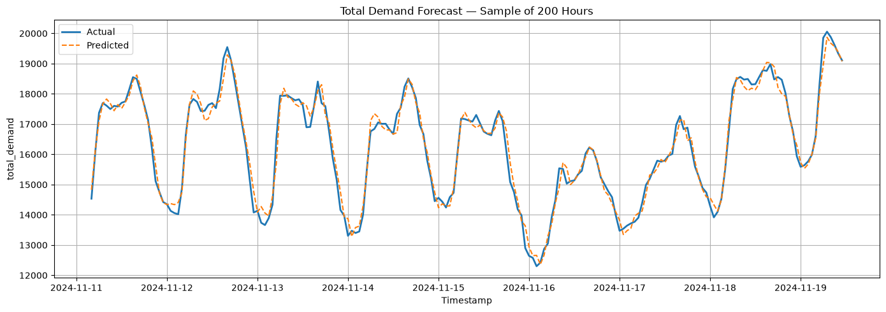

# Sweden Electricity Demand Forecasting

An exploratory machine learning project that models Sweden's hourly electricity demand using historical load, generation, and calendar patterns. It demonstrates the workflow from raw CSV cleaning and visualization to XGBoost training and hyperparameter tuning—a starting point for studying demand forecasting for energy planning.

## What the data shows

The [visualization notebook](Data_Visualisation.ipynb) explores both electricity demand and changes in generation:

- **Strong seasonality:** demand is higher in winter and lower in summer, visible across hourly, daily, weekly, and monthly views.
- **A recurring daily pattern:** across 2022–2024, average demand is lowest around 02:00 UTC and highest around 16:00 UTC. This supports using hour-of-day features and daily lags.
- **A modest demand dip and recovery:** annual mean demand was 15,082 MW in 2022, 14,911 MW in 2023, and 15,011 MW in 2024.
- **Growing wind and solar output:** between 2022 and 2024, mean onshore wind generation rose from 3,739 to 4,592 MW (about 23%), while solar rose from 94 to 211 MW (about 124%). These describe the supplied dataset; they do not establish what caused the changes.


*Each faint line represents one day from January 2022 through July 22, 2025; the red dashed line shows the average. Hours are UTC.*

Demand is lowest in the early morning, rises sharply through the morning, dips slightly around midday, and reaches its average peak around 16:00 UTC before declining overnight. The spread of daily curves shows how much demand varies around this recurring pattern. Across the year, the notebook's time-series and smoothed plots show higher winter demand and lower summer demand. Together, these observations motivate daily lags and calendar features in the forecasting model.


*Monthly mean power (MW) for four selected generation sources, not monthly energy totals or the entire generation mix.*

Hydro and nuclear make up the largest combined contribution among the four plotted sources, while wind and solar output increased between 2022 and 2024. The monthly comparison also shows seasonal variation in the generation mix.

These summaries adapt the observations in the visualization notebook. See the [year-by-year hourly profiles](docs/figures/hourly-demand-by-year.png) and [2024 demand seasonality figure](docs/figures/demand-seasonality.png) for further detail. Figures are exported from saved notebook outputs; annual averages above were checked against the cleaned CSV.

## Forecasting results

Built a dataset of **31,176 hourly observations** from January 2022 through July 22, 2025. The saved notebook run reports:

| Model | MAE (MW, lower is better) | R² |
|---|---:|---:|
| Initial XGBoost | 216.40 | 0.9920 |
| XGBoost with Optuna tuning (30 trials) | 210.03 | 0.9925 |

Tuning reduced the reported mean absolute error by approximately **2.9%**. These are **exploratory results**, not a verified estimate of future forecasting accuracy: rolling features include the current target, and tuning reuses the evaluation period. See the evaluation notes below.



*Initial XGBoost model: first 200 hours of the evaluation period, extracted from the saved notebook output. Demand is measured in MW; the same evaluation limitations apply to this chart.*

## What I built

- Combined yearly demand and generation CSVs, aligned timestamps, removed duplicates, and handled missing values.
- Created demand and renewable-generation lags, calendar features, cyclical encodings, and rolling statistics.
- Trained XGBoost with a chronological 80/20 split and explored hyperparameters with Optuna.
- Visualized demand and generation patterns with Matplotlib, Seaborn, and Plotly.

**Tools:** Python, pandas, NumPy, scikit-learn, XGBoost, Optuna, Matplotlib, Seaborn, and Plotly.

## Explore the project

| File | Purpose |
|---|---|
| [Sweden_Energy_Demand_Forecast.ipynb](Sweden_Energy_Demand_Forecast.ipynb) | Data cleaning, feature engineering, model training, tuning, and evaluation |
| [Data_Visualisation.ipynb](Data_Visualisation.ipynb) | Exploration of the cleaned energy data |
| `data/raw/` | Yearly demand and generation CSVs for 2022–2025 |
| `data/clean/Cleaned_Sweden_Energy.csv` | Cleaned dataset produced by the forecasting notebook |
| [requirements.txt](requirements.txt) | Python dependencies |

The raw data includes actual load, day-ahead load forecasts, and generation by production type. Timestamps are labeled UTC in the input files. Original download provenance and redistribution terms still need to be documented.

## Run locally

Local environment used: **Python 3.12.3**, Windows, and VS Code with the Python and Jupyter extensions.

From the repository root, create an environment and install dependencies:

```cmd
python -m venv .venv-win
.venv-win\Scripts\python.exe -m pip install -r requirements.txt
```

1. Ensure `data/raw/` contains `Demand_2022.csv` through `Demand_2025.csv` and `GenerationType_2022.csv` through `GenerationType_2025.csv`.
2. Create `data/clean/` if it is missing; the notebook writes its cleaned CSV there.
3. Open `Sweden_Energy_Demand_Forecast.ipynb`, select `.venv-win` as the kernel, and run the cells in order from the repository root. The Optuna section runs 30 training trials.
4. Run `Data_Visualisation.ipynb` after the cleaned CSV has been created.

The table above comes from saved notebook outputs. Most dependency versions and the Optuna sampler are not pinned, so reruns may produce different results.

## Evaluation notes and next steps

The current notebook is an analysis prototype. Before using its metrics to assess forecasting performance:

- **Remove target leakage:** shift demand before computing rolling statistics, and use only inputs available at the intended forecast time. Current generation measurements also require an availability check.
- **Separate tuning from testing:** use chronological validation for Optuna and reserve a final untouched test period. Compare against a seasonal naive forecast and the supplied day-ahead forecast on that same period.
- **Check feature quality:** missing generation values are filled with zero, and the saved holiday feature contains no flagged holidays. Both choices need review.

The notebook's full-dataset comparison includes training rows, so it is not used here as evidence of performance on unseen data. Automated tests and deployment are not yet included.
