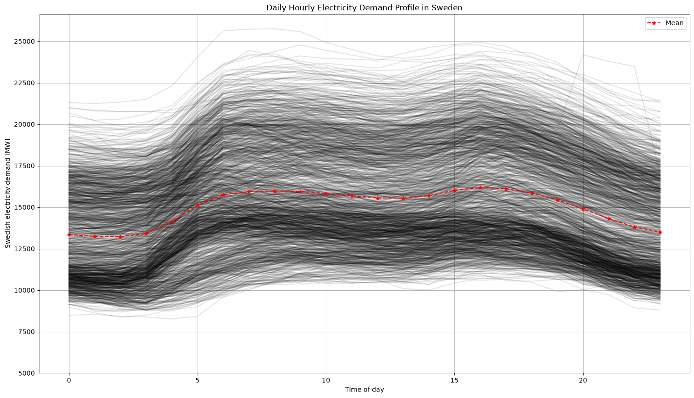
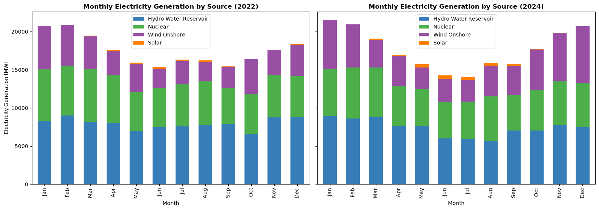
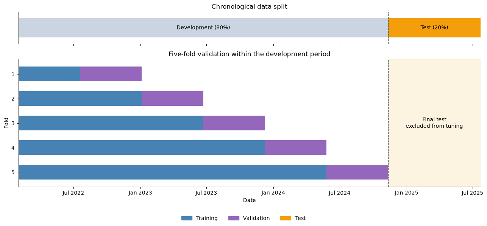
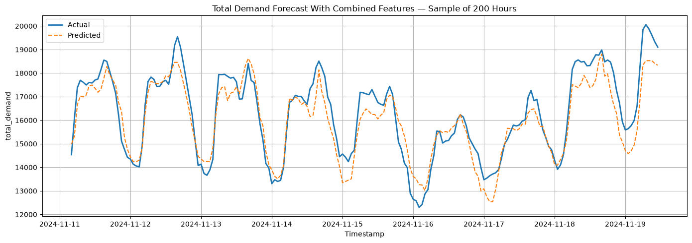

# Sweden Day-Ahead Electricity Demand Forecasting

An exploratory machine learning project focused on **day-ahead forecasting of Sweden's hourly electricity demand** using historical load, generation, and calendar patterns. The goal is to predict the next day's hourly demand profile. It demonstrates the workflow from raw CSV cleaning and visualization to XGBoost training and hyperparameter tuning, with forecast-time availability still to be enforced in the evaluation.

## What the data shows

The [visualization notebook](Data_Visualisation.ipynb) explores both electricity demand and changes in generation:

- **Strong seasonality:** demand is higher in winter and lower in summer, visible across hourly, daily, weekly, and monthly views.
- **A recurring daily pattern:** across 2022–2024, average demand is lowest around 02:00 UTC and highest around 16:00 UTC. This supports using hour-of-day features and daily lags.
- **A modest demand dip and recovery:** annual mean demand was 15,082 MW in 2022, 14,911 MW in 2023, and 15,011 MW in 2024.
- **Growing wind and solar output:** between 2022 and 2024, mean onshore wind generation rose from 3,739 to 4,592 MW (about 23%), while solar rose from 94 to 211 MW (about 124%). These describe the supplied dataset; they do not establish what caused the changes.



*Each faint line represents one day from January 2022 through July 22, 2025; the red dashed line shows the average. Hours are UTC.*

Demand is lowest in the early morning, rises sharply through the morning, dips slightly around midday, and reaches its average peak around 16:00 UTC before declining overnight. The spread of daily curves shows how much demand varies around this recurring pattern. Across the year, the notebook's time-series and smoothed plots show higher winter demand and lower summer demand. Together, these observations motivate daily lags and calendar features in the forecasting model.



*Monthly mean power (MW) for four selected generation sources, not monthly energy totals or the entire generation mix.*

Hydro and nuclear make up the largest combined contribution among the four plotted sources, while wind and solar output increased between 2022 and 2024. The monthly comparison also shows seasonal variation in the generation mix.

These summaries adapt the observations in the visualization notebook. See the [year-by-year hourly profiles](docs/figures/hourly-demand-by-year.png) and [2024 demand seasonality figure](docs/figures/demand-seasonality.png) for further detail. Figures are exported from saved notebook outputs; annual averages above were checked against the cleaned CSV.

## Modeling approach and validation

The cleaned dataset contains **31,176 hourly observations** from January 2022 through July 22, 2025. [Model_Training.ipynb](Model_Training.ipynb) retains **30,456 rows** after creating demand lags up to 720 hours and dropping missing rows. The first **24,364 rows (80%)** form the development set; the last **6,092 rows (20%)**, from November 11, 2024 at 04:00 UTC through July 22, 2025, form the test set.

- **Demand and calendar features:** demand lags of 24, 48, 168, 336, and 720 hours; hour, day of month, weekday, and month; sine/cosine encodings of hour and month; weekend, winter, summer, and Swedish holiday flags. Short demand lags and unshifted rolling statistics are excluded from the current feature list.
- **Generation features:** `Other`, `Hydro Water Reservoir`, `Nuclear`, `Wind Onshore`, and `Solar`. The combined model uses both feature groups.
- **Optuna validation:** 30 trials, each evaluated with `TimeSeriesSplit(n_splits=5)` on development data only. Training expands across folds, and each trial returns mean validation MAE. This makes 150 model fits during tuning.
- **Final fit:** the best settings are used to retrain on all development rows before predicting the final test period. The saved best mean validation MAE is **614.86 MW**, distinct from the final test MAE of **620.78 MW**.

Optuna searches `n_estimators` (100–500), `max_depth` (3–15), `learning_rate` (0.01–0.3), `subsample` and `colsample_bytree` (0.6–1.0), `gamma` (0–5), and `min_child_weight` (1–10). XGBoost's `random_state` is fixed at 42. The notebook includes plots of actual demand and predictions over the first 200 test hours for each initial model.



*Both panels share a calendar-date axis. The top panel shows the first 80% of observations as development data (gray) and the final 20% as test data (orange). Below, each fold uses an expanding training window (blue) followed by a validation window (purple). Blank areas within the development period are unused in that fold. The dashed line marks the start of the final test period, shaded orange below to show that it is excluded from tuning.*

## Forecasting results

The saved notebook outputs report the following scores on that test period:

| Model | MAE (MW, lower is better) | R² |
|---|---:|---:|
| XGBoost: demand lags and calendar features | 634.96 | 0.9310 |
| XGBoost: generation features only | 1102.52 | 0.8093 |
| XGBoost: combined features | 623.40 | 0.9331 |
| XGBoost: combined features, Optuna tuning | 620.78 | 0.9332 |

Tuning reduced combined-model test MAE by approximately **0.42%**. These are exploratory model results: generation-based models use actual target-hour generation, and forecast issue times are not yet enforced. They do not establish deployable day-ahead performance.



*Total Demand Forecast With Combined Features: the initial XGBoost model before Optuna tuning, using demand/calendar and generation features. This saved notebook plot shows the first 200 test hours; its full-test MAE is 623.40 MW and R? is 0.9331. The forecast-time limitations above also apply to this plot.*

## What I built

- Combined yearly demand and generation CSVs, aligned timestamps, removed duplicates, and handled missing values.
- Compared demand/calendar, generation-only, and combined feature sets for XGBoost.
- Separated development and test periods chronologically and tuned with five-fold time-series validation using Optuna.
- Evaluated initial and tuned XGBoost models using test-period MAE and R².
- Visualized demand and generation patterns with Matplotlib, Seaborn, and Plotly.

**Tools:** Python, pandas, NumPy, scikit-learn, XGBoost, Optuna, Matplotlib, Seaborn, and Plotly.

## Explore the project

| File | Purpose |
|---|---|
| [Sweden_Energy_Demand_Forecast.ipynb](Sweden_Energy_Demand_Forecast.ipynb) | Data preparation and export of the cleaned CSV |
| [Model_Training.ipynb](Model_Training.ipynb) | Feature comparisons, time-series cross-validation, Optuna tuning, and test evaluation |
| [Data_Visualisation.ipynb](Data_Visualisation.ipynb) | Exploration of the cleaned energy data |
| `data/raw/` | Yearly demand and generation CSVs for 2022–2025 |
| `data/clean/Cleaned_Sweden_Energy.csv` | Cleaned dataset produced by the forecasting notebook |
| [requirements.txt](requirements.txt) | Python dependencies |

The raw data includes actual load, day-ahead load forecasts, and generation by production type. Timestamps are labeled UTC in the input files. Original download provenance and redistribution terms still need to be documented.

## Run locally

Local environment used: **Python 3.12.3**, Windows, and VS Code with the Python and Jupyter extensions.

From the repository root, create an environment and install dependencies:

```cmd
python -m venv .venv-win
.venv-win\Scripts\python.exe -m pip install -r requirements.txt
```

1. Ensure `data/raw/` contains `Demand_2022.csv` through `Demand_2025.csv` and `GenerationType_2022.csv` through `GenerationType_2025.csv`.
2. Create `data/clean/` if it is missing; the notebook writes its cleaned CSV there.
3. Open `Sweden_Energy_Demand_Forecast.ipynb`, select `.venv-win` as the kernel, and run the data-preparation cells through the cleaned CSV export from the repository root.
4. Open `Model_Training.ipynb` with the same kernel environment. Restart its kernel and run all cells in order. Its feature cell removes `forecast` from `df`, so rerunning that cell alone requires first reloading the CSV. The Optuna section runs 30 trials across five folds.
5. Run `Data_Visualisation.ipynb` to explore the cleaned data.

The table above comes from saved notebook outputs. Most dependency versions and the Optuna sampler are not pinned, so reruns may produce different results.

## Evaluation notes and next steps

The current notebook is an analysis prototype. Before using its metrics to assess forecasting performance:

- **Enforce forecast-time availability:** actual target-hour generation is not available a day ahead. Replace it with forecasts available at issue time, lag it appropriately, or omit it. A 24-hour demand lag can support a rolling 24-hour-ahead prediction if measurements are available, but may be unavailable for some hours when forecasting all of tomorrow at a fixed time today. Training cutoffs and validation gaps must also reflect the forecast issue time.
- **Preserve an independent final evaluation:** Optuna now uses only development folds, but the final period is also inspected in feature comparisons and earlier experiments. Reserve a later, unused period for a final assessment after model and feature choices are fixed. Add daily and weekly seasonal-naive baselines.
- **Check feature quality and time alignment:** confirm chronological, equally spaced hourly data before row-based lagging and splitting; validate holiday flags and local-calendar handling; review generation values filled with zero during cleaning.

The current comparison plot and metrics use test rows only. Earlier results and the existing `docs/figures/demand-prediction.png` come from the previous modeling setup and are not used as evidence for the current results. Automated tests and deployment are not yet included.
